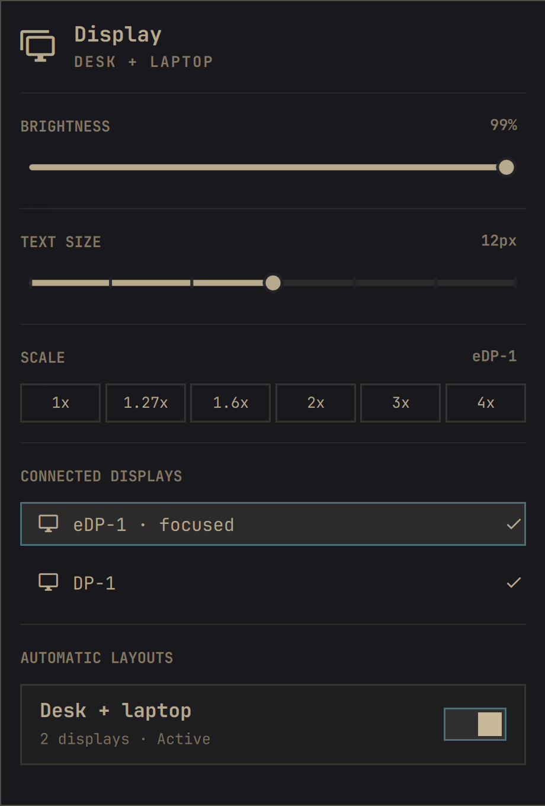
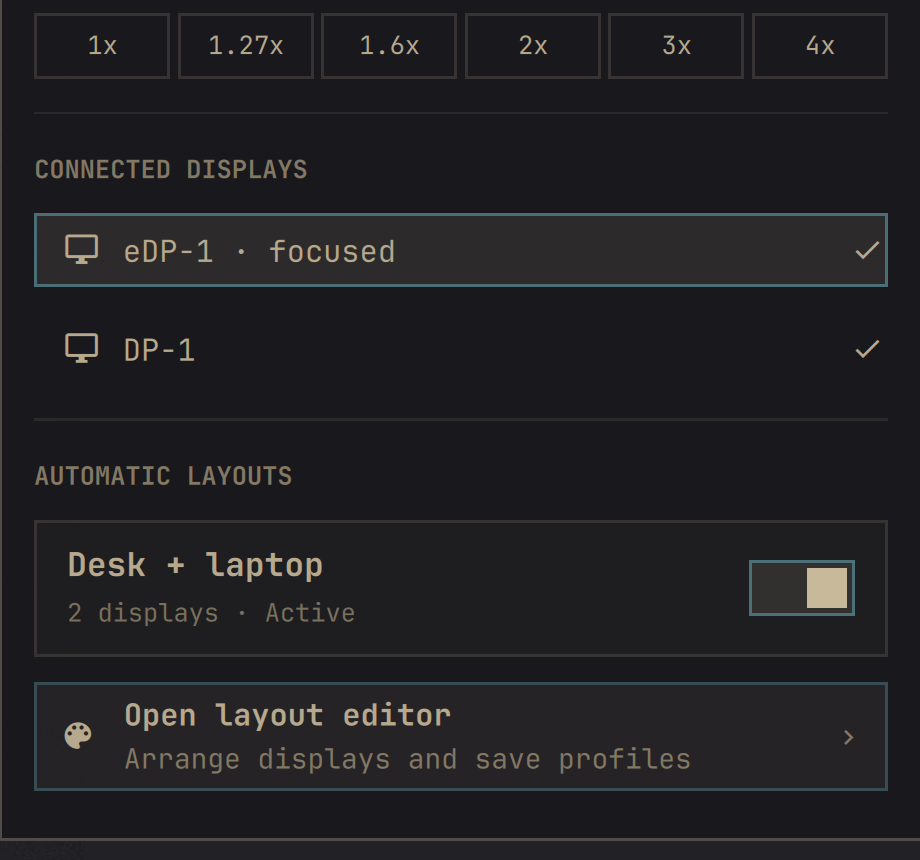
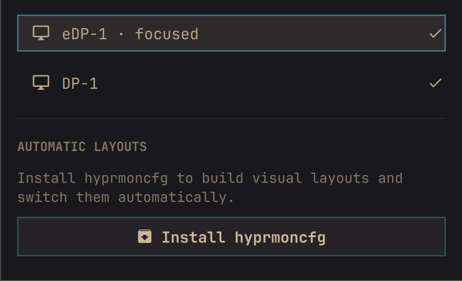

# Omarchy Display Manager

A single Omarchy bar widget for everyday display controls and automatic
multi-monitor layouts. It combines Omarchy's built-in Display panel with
[hyprmoncfg](https://github.com/crmne/hyprmoncfg) profile status, automatic
switching, and a shortcut to the visual layout editor.

If hyprmoncfg is missing or too old, the panel opens an ordinary Omarchy
presented terminal for the install or update. No package installation or
privileged command is hidden inside the shell process.

## Features

- Display brightness control with scroll-wheel support
- Shell and GTK text-size control
- Per-display scale presets
- Connected-display enable and disable controls
- Active and recommended hyprmoncfg profile status
- Automatic layout switching toggle
- One-click access to the hyprmoncfg layout editor
- Full mouse and keyboard navigation

## Screenshots

### Everyday display controls

Brightness, text size, scaling, connected displays, and the active automatic
layout are available from one bar panel.

<p align="center">
  
</p>

### Profiles and layout editor

The hyprmoncfg service can be toggled in place, while the visual editor remains
one action away for arranging displays and saving profiles.



### Guided first run

When hyprmoncfg is unavailable, the panel explains what it adds and presents a
clear install action. Installation runs visibly in an Omarchy terminal.



The screenshots were captured on an empty workspace and cropped to the panel.
The example profile name is anonymized; no personal configuration is included.

## Requirements

- Omarchy 4.0 or newer with shell plugin support
- hyprmoncfg 1.12.0 or newer (installable from the panel)

## Install

```sh
omarchy plugin add https://github.com/Harshith292002/omarchy-display-manager.git --enable
```

The manifest declares that this plugin is a clone of `omarchy.monitor`, so
Omarchy replaces the built-in Display bar entry instead of adding a duplicate.

Open **Display → Open layout editor** to arrange the connected monitors and
save a profile. hyprmoncfg profiles are hardware-specific and remain under
`~/.config/hyprmoncfg/profiles/`; they are intentionally not stored in this
repository.

If prompted, choose **Install hyprmoncfg**. The visible installer runs:

```sh
omarchy pkg aur add hyprmoncfg
systemctl --user enable hyprmoncfgd.service
systemctl --user restart hyprmoncfgd.service
```

## Update

```sh
omarchy plugin update harshith.monitor --yes
omarchy restart shell
```

## Development

The live plugin directory is also the Git checkout:

```sh
cd ~/.config/omarchy/plugins/harshith.monitor
omarchy plugin validate .
node --test tests/model.test.js
```

Changes under this directory are normally hot-reloaded by Omarchy. Restart the
shell when a changed QML component remains cached:

```sh
omarchy restart shell
```

`Panel.qml` and `Model.js` began as a clone of Omarchy's MIT-licensed built-in
Display plugin. The automatic-layout integration uses hyprmoncfg's public IPC
protocol. See [NOTICE](NOTICE) for attribution.

## License

MIT. See [LICENSE](LICENSE).
